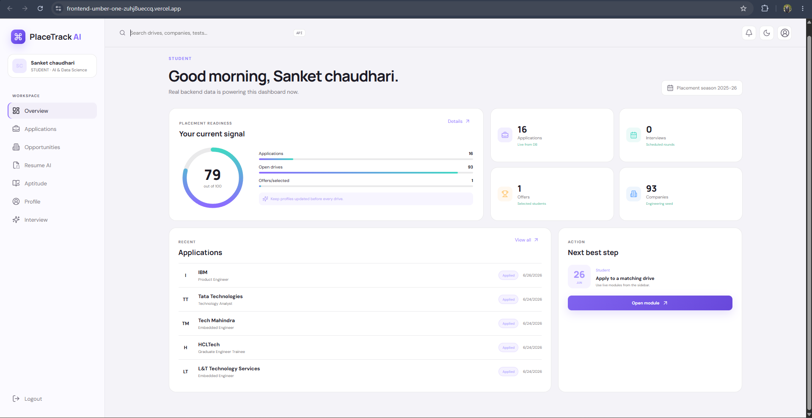
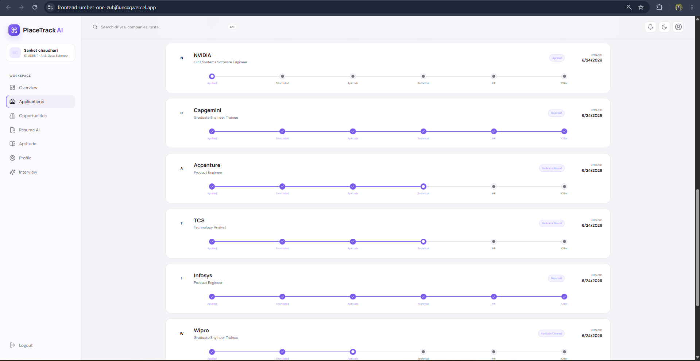
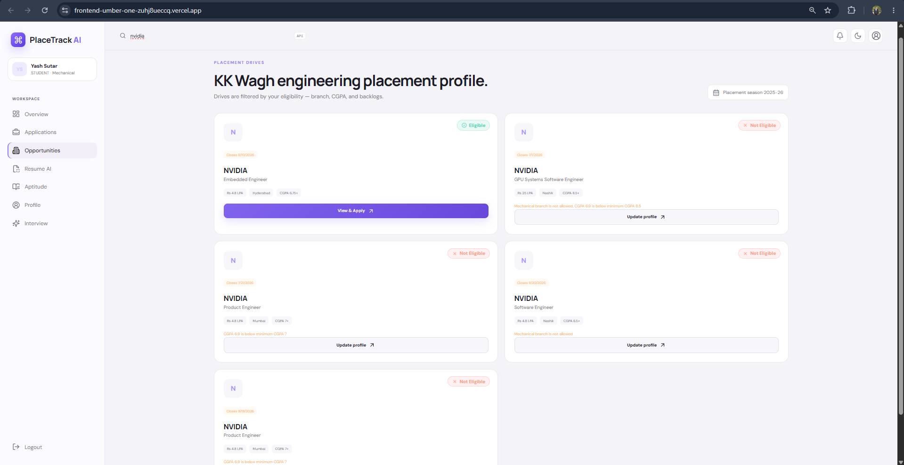
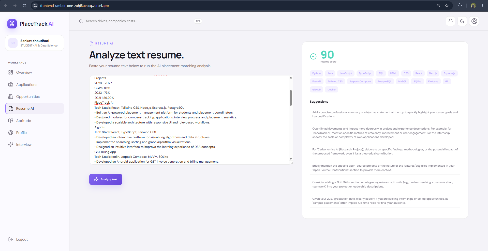
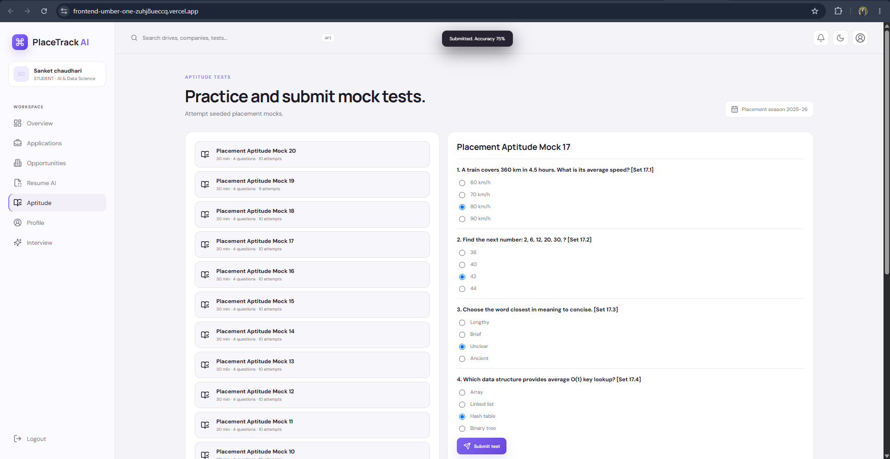
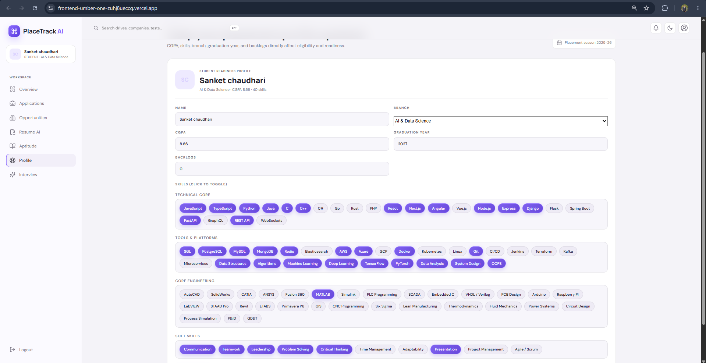
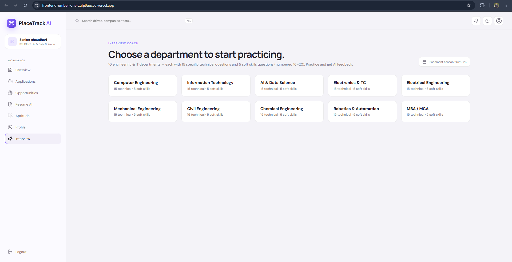
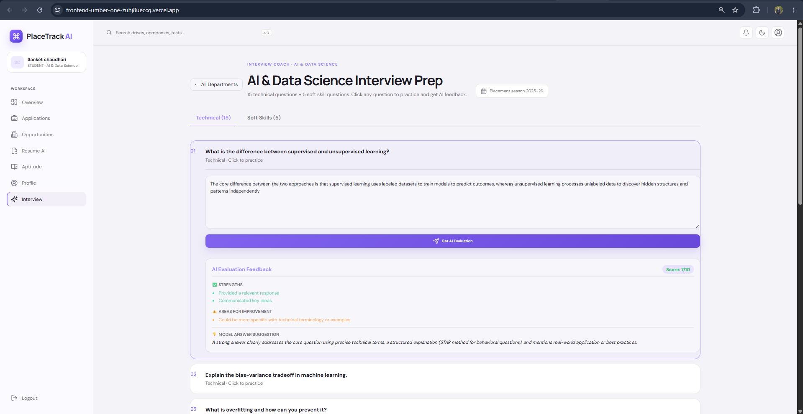

# PlaceTrack AI

**Enterprise-grade Placement Management & Student Readiness Platform for Engineering Colleges**

[](https://frontend-umber-one-zuhj8ueccq.vercel.app/)
[](https://nextjs.org/)
[](https://react.dev/)
[](https://www.typescriptlang.org/)
[](https://expressjs.com/)
[](https://www.postgresql.org/)
[](https://www.prisma.io/)
[](https://ai.google.dev/)
[](https://www.docker.com/)
[](https://vitest.dev/)
[](LICENSE)

> **[🚀 Live Demo → frontend-umber-one-zuhj8ueccq.vercel.app](https://frontend-umber-one-zuhj8ueccq.vercel.app/)**

A full-stack placement management platform enabling students to track applications, analyze resumes with AI, practice aptitude tests, and prepare for interviews — while coordinators and admins manage drives, pipelines, and reports from a unified dashboard.

---

## Screenshots

| Dashboard | Applications |
|:---------:|:------------:|
|  |  |

| Opportunities | Resume AI |
|:-------------:|:---------:|
|  |  |

| Aptitude Test | Profile |
|:-------------:|:-------:|
|  |  |

| Interview Coach | AI Feedback |
|:---------------:|:-----------:|
|  |  |

---

## Features

**Student Portal**
- Readiness score ring computed from CGPA, aptitude, coding, communication, projects, internships, and mock counts
- Job board with real-time eligibility check and suitability score per drive
- AI-powered resume analysis via Google Gemini with heuristic fallback
- Timed aptitude mock tests with server-side grading and section-wise feedback
- AI interview coach generating role-specific questions with answer evaluation
- In-app notifications for application status changes and interview schedules
- **90 skills across 4 categories** (Technical Core, Tools & Platforms, Core Engineering, Soft Skills) covering all 10 branches — CS, IT, AI/DS, Electronics, Electrical, Mechanical, Civil, Chemical, and more

**Coordinator & Admin Portal**
- Create and manage placement drives with branch filters, CGPA caps, backlog limits, and deadlines
- Progress student applications through a strict pipeline: `APPLIED → SHORTLISTED → APTITUDE_CLEARED → TECHNICAL_ROUND → HR_ROUND → SELECTED / REJECTED`
- Schedule interviews and push notifications to candidates
- Export full student registry and application data as CSV reports
- Admin user management with audit trail logging

---

## Architecture

```
graph TD
    Client[Next.js Frontend] <-->|JSON + JWT Auth| Express[Express.js Server]
    Express <-->|Prisma Client| DB[(PostgreSQL on Neon)]
    Express <-->|REST API| Gemini[Google Gemini AI]
    Express -->|Fallback| Heuristics[Regex Heuristic Parser]
```

**Monorepo Structure**

```
├── backend/
│   ├── prisma/
│   │   ├── schema.prisma          # Database schema
│   │   └── seed.ts                # 150-student seed script
│   ├── src/
│   │   ├── lib/                   # Prisma client & audit logger
│   │   ├── middleware/            # JWT auth & RBAC guards
│   │   ├── routes/                # REST endpoints by resource
│   │   ├── services/              # Eligibility, readiness & AI integrations
│   │   ├── types/                 # TypeScript annotations
│   │   └── server.ts              # Server entrypoint with auto-seed
│   └── tests/                     # Vitest unit test suite
│
├── frontend/
│   └── src/
│       ├── app/                   # Next.js App Router
│       ├── components/            # Dashboard, Resume AI, UI components
│       └── lib/                   # API wrappers, types, credentials
│
├── docker-compose.yml             # PostgreSQL container (local dev)
├── package.json                   # Monorepo workspaces config
└── .env.example                   # Environment variable template
```

---

## Core Algorithms

### Student Readiness Predictor

A backend scoring engine that maps academic and assessment metrics to a placement probability score:

```
Readiness Score = clamp(
  (CGPA / 10 × 22) +
  (Aptitude × 0.18) +
  (Coding × 0.22) +
  (Communication × 0.15) +
  (Projects × 4) +
  (Internships × 5) +
  (Mock Tests × 1.2) -
  (Active Backlogs × 7)
)
```

| Range | Status |
|-------|--------|
| >= 80 | Placement Ready |
| 65 – 79 | Nearly Ready |
| < 65 | Needs Focused Preparation |

### Placement Eligibility Engine

Hard constraints validated before a student can apply to any drive:

- CGPA >= drive minimum
- Active backlogs <= drive maximum
- Branch within allowed departments
- Graduation year matches drive cohort

Eligible applications receive a **suitability score (50–100)** based on academic margin (+15), skill keyword overlap (+30), and branch specificity (+15).

### AI Resume Analyzer

Resume PDFs are parsed via `pdf-parse` into raw text, then sent to Google Gemini (`gemini-2.5-flash`) with a structured JSON prompt. Response fields: `score`, `skills`, `sectionHits`, `suggestions`, `contactComplete`. A regex heuristic fallback activates automatically if the API key is absent or rate-limited — the platform remains fully functional offline.

---

## API Reference

| Method | Endpoint | Auth | Description |
|--------|----------|------|-------------|
| GET | `/health` | Public | Database connectivity health check |
| POST | `/api/auth/login` | Public | Login and receive signed JWT |
| POST | `/api/auth/signup` | Public | Register student or coordinator |
| GET | `/api/auth/me` | User | Fetch profile and unread notifications |
| PATCH | `/api/auth/me/student` | Student | Update profile and recalculate readiness |
| GET | `/api/auth/users` | Admin | List all registered accounts |
| DELETE | `/api/auth/users/:id` | Admin | Delete account and dependencies |
| GET | `/api/dashboard` | User | Role-specific aggregated dashboard data |
| GET | `/api/drives` | User | List drives with eligibility state per student |
| POST | `/api/drives` | Coordinator, Admin | Create a placement drive |
| GET | `/api/applications` | User | Query applications (owner-scoped for students) |
| POST | `/api/applications` | Student | Submit eligibility-filtered application |
| PATCH | `/api/applications/:id/status` | Coordinator, Admin | Advance application pipeline stage |
| POST | `/api/applications/:id/interview` | Coordinator, Admin | Schedule interview and notify student |
| GET | `/api/tests` | User | List all aptitude tests |
| GET | `/api/tests/:id` | User | Fetch test details and questions |
| POST | `/api/tests/:id/submit` | Student | Submit answers and record scored result |
| POST | `/api/ai/resume/text` | Student | Analyze raw text resume |
| POST | `/api/ai/resume/upload` | Student | Extract and analyze PDF resume |
| POST | `/api/ai/interview` | User | Generate role-specific interview questions |
| POST | `/api/ai/interview/feedback` | User | Evaluate answer with score and model response |
| GET | `/api/reports/applications.csv` | Coordinator, Admin | Export application data as CSV |
| GET | `/api/reports/students.csv` | Coordinator, Admin | Export student performance registry as CSV |

---

## Getting Started

### Prerequisites

- Node.js v20+
- Docker Desktop (for local PostgreSQL)

### Step 1 — Environment Setup

```bash
cp .env.example .env
```

Configure the following in `.env`:

| Variable | Description |
|----------|-------------|
| `DATABASE_URL` | Neon PostgreSQL pooler connection string |
| `DIRECT_URL` | Neon direct URL for Prisma migrations |
| `JWT_SECRET` | Secure string for signing auth tokens |
| `GEMINI_API_KEY` | Google AI key (optional — heuristic fallback activates if absent) |
| `FRONTEND_URL` | Allowed CORS origin (default: `http://localhost:3000`) |

### Step 2 — Start Database

```bash
docker compose up -d
```

### Step 3 — Install, Migrate & Seed

```bash
# Install all workspace dependencies
npm install

# Push Prisma schema to database
npm run prisma:push -w backend

# Seed with 150 student profiles, companies, drives, and tests
npm run prisma:seed -w backend
```

### Step 4 — Run Development Servers

```bash
npm run dev
```

| Service | URL |
|---------|-----|
| Frontend | http://localhost:3000 |
| Backend API | http://localhost:4000 |
| Health Check | http://localhost:4000/health |

Demo accounts are pre-seeded. Refer to `backend/prisma/seed.ts` for login credentials.

---

## Testing

```bash
# Run backend unit tests
npm test

# TypeScript type check across all packages
npm run typecheck
```

---

## Security

- JWT authentication with `HS256`, 12-hour expiry
- Role-based access control (`STUDENT`, `COORDINATOR`, `ADMIN`) enforced via middleware
- Helmet for secure HTTP headers
- Rate limiting: 300 requests / 60 seconds per IP on all `/api/*` routes
- Zod schema validation on all request bodies before database calls
- In-memory PDF processing via `multer.memoryStorage()` — no resume files written to disk
- `Cache-Control: no-store` on all API responses

---

## Database Schema

| Model | Purpose | Key Indexes |
|-------|---------|-------------|
| `User` | Auth entity with role | Unique email |
| `Student` | Academic profile | `[branch, graduationYear]`, `[readinessScore]` |
| `Coordinator` | Staff department info | Unique userId |
| `Company` | Recruiter registry | Unique name |
| `PlacementDrive` | Job opening with constraints | `[status, deadline]`, `[graduationYear]` |
| `Application` | Student-Drive relationship | Unique `[studentId, driveId]`, `[status]` |
| `Interview` | Scheduled interview per application | Unique applicationId |
| `AptitudeTest` | Test blueprint | — |
| `Question` | MCQ per test | — |
| `TestResult` | Submission scores and metrics | Unique `[studentId, testId]` |
| `Notification` | In-app user alerts | — |
| `ActivityLog` | Admin audit trail | `[timestamp]`, `[resource]` |
| `ResumeAnalysis` | Persisted AI scan results | `[userId, createdAt]` |

---

## License

MIT © [Sanket Chaudhari](https://github.com/sanket1035)
